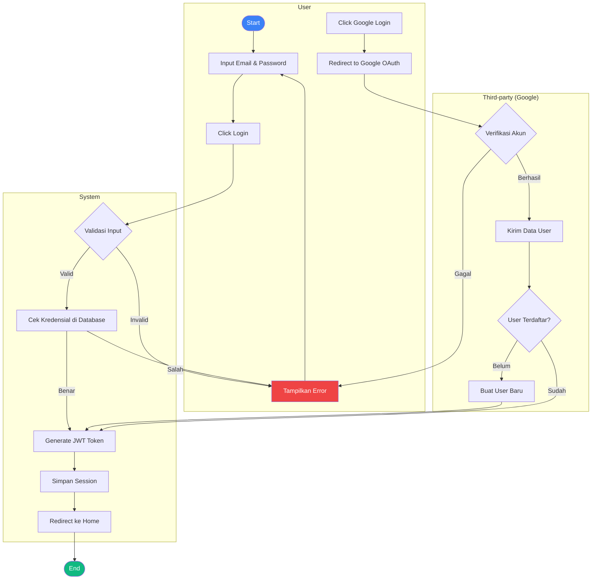
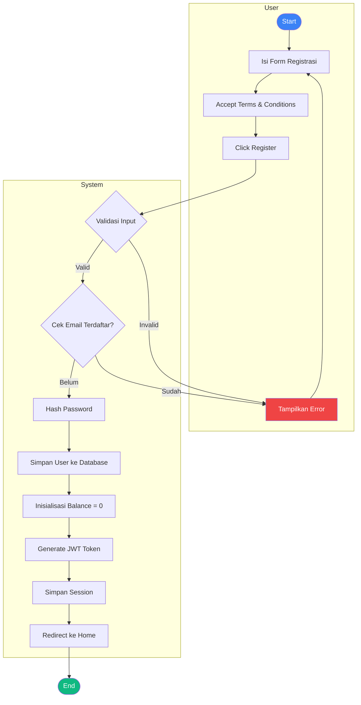
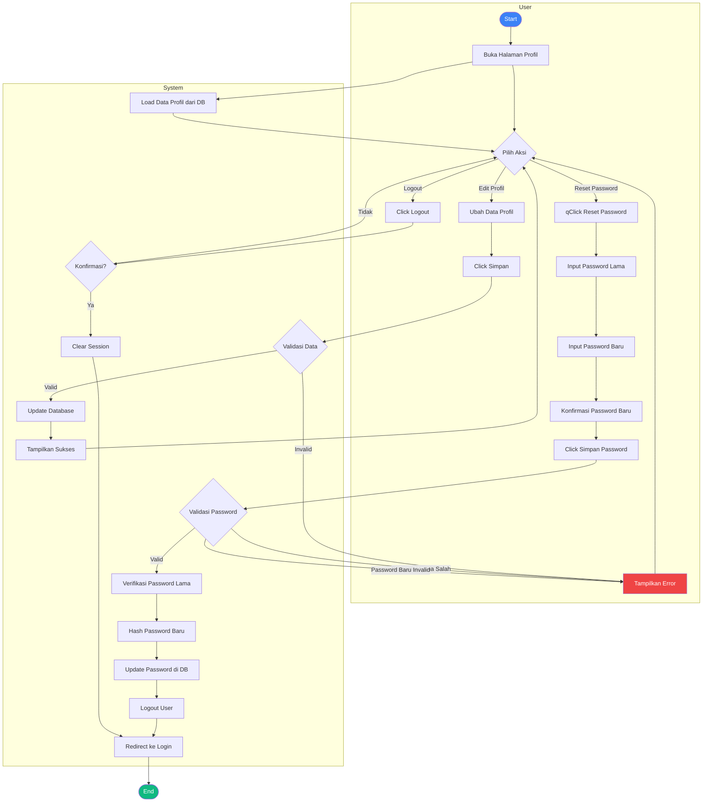
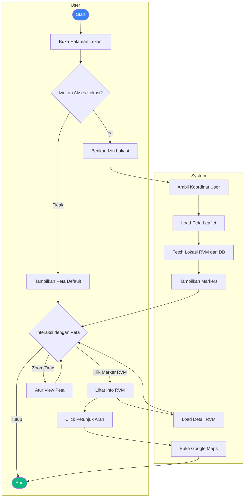
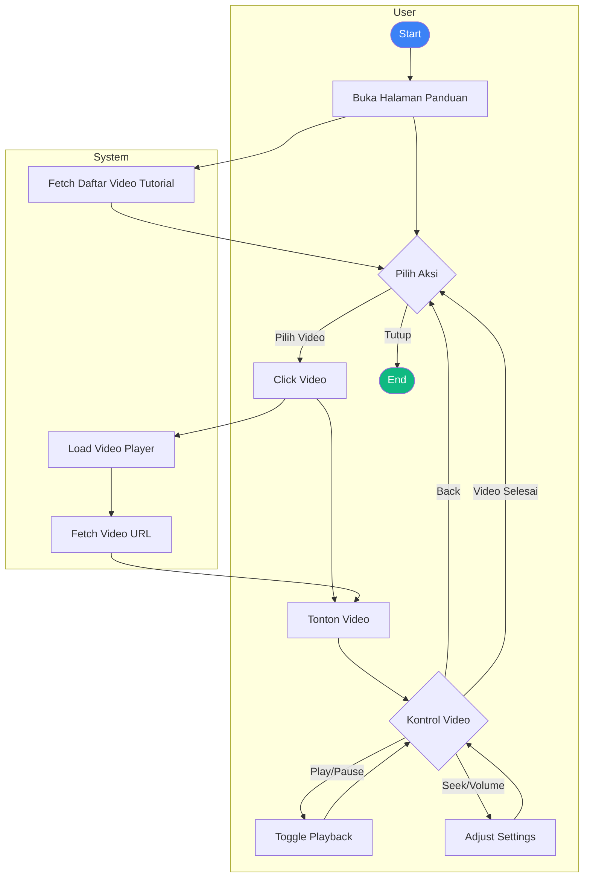
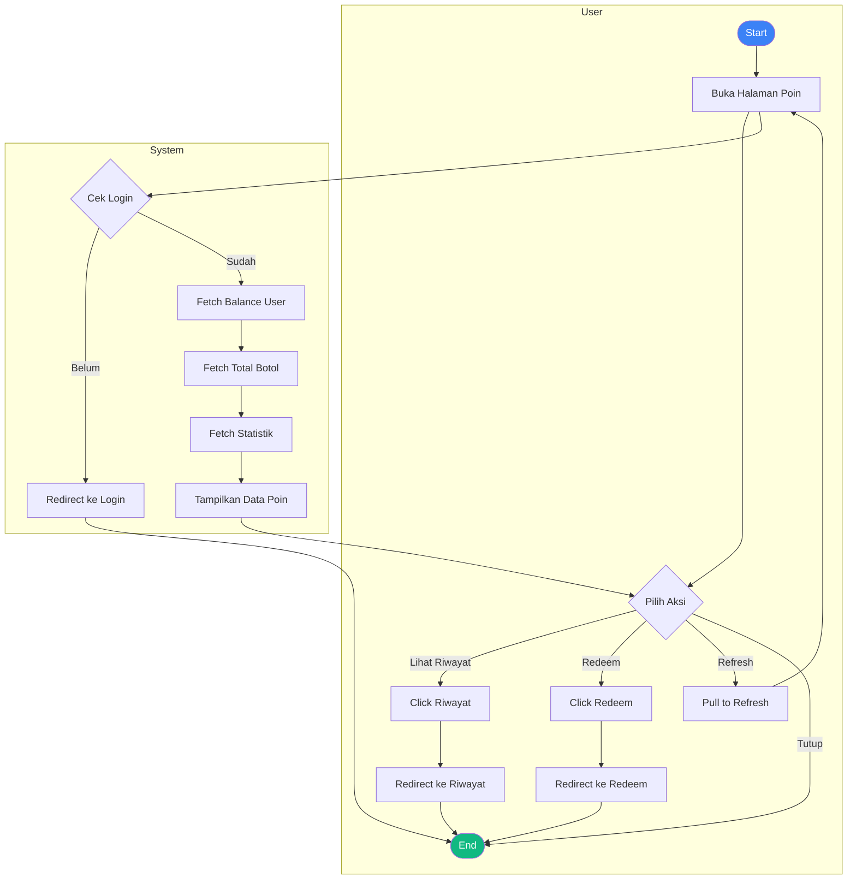
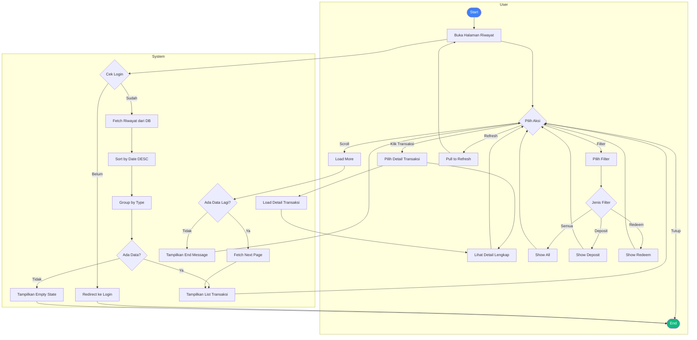
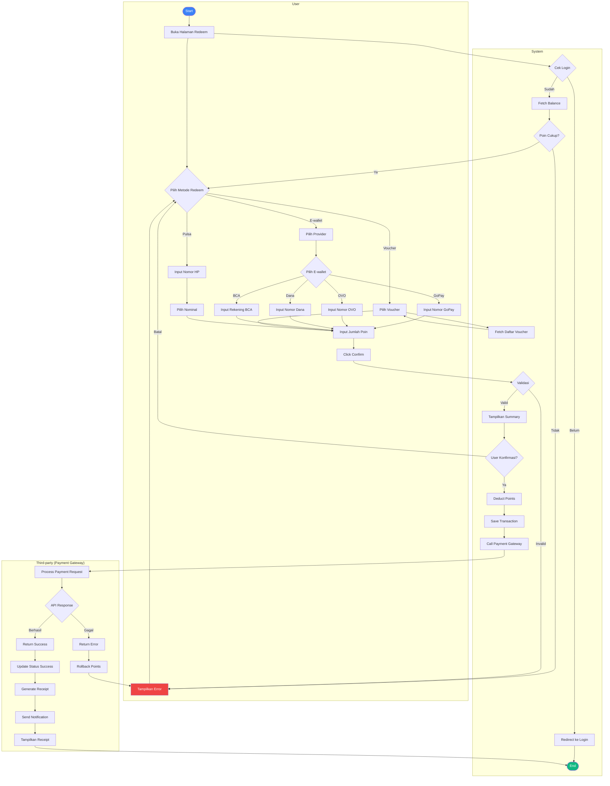
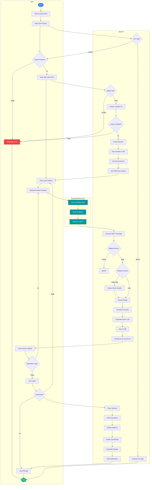

# Activity Diagrams - RVM Application (Swimlane Format)

Activity diagrams berdasarkan use case diagram sistem RVM (Reverse Vending Machine) menggunakan format swimlanes (simulasi dengan subgraph Mermaid) untuk menunjukkan tanggung jawab antar aktor.

---

## 1. Login Activity Diagram

---

## 2. Register Activity Diagram

---

## 3. Manage Profile Activity Diagram (with Reset Password Extension)

---

## 4. View RVM Location Activity Diagram

---

## 5. View Tutorial Video Activity Diagram

---

## 6. View Points Activity Diagram

---

## 7. View Transaction History Activity Diagram

---

## 8. Redeem Reward Activity Diagram

---

## 9. Deposit Bottles Activity Diagram (includes Scan QR Code)

---

## Summary

File ini berisi **9 activity diagrams dalam format swimlanes** yang sesuai dengan use case diagram sistem RVM:

### Swimlanes yang Digunakan:
- **User**: Aktivitas yang dilakukan oleh pengguna
- **System**: Proses yang dilakukan oleh backend sistem (Next.js, Database, Socket.IO)
- **Arduino/RVM Device**: Aktivitas perangkat IoT untuk deteksi botol
- **Third-party**: Integrasi eksternal (Google OAuth, Payment Gateway)

### Daftar Activity Diagrams:

1. **Login** - User, System, Third-party (Google OAuth)
2. **Register** - User, System
3. **Manage Profile** (extends: Reset Password) - User, System
4. **View RVM Location** - User, System
5. **View Tutorial Video** - User, System
6. **View Points** - User, System
7. **View Transaction History** - User, System
8. **Redeem Reward** - User, System, Third-party (Payment Gateway)
9. **Deposit Bottles** (includes: Scan QR Code) - User, System, Arduino

Setiap diagram menunjukkan alur kerja lengkap dengan swimlanes untuk memisahkan tanggung jawab antar aktor, decision points, error handling, dan integrasi sistem real-time.

